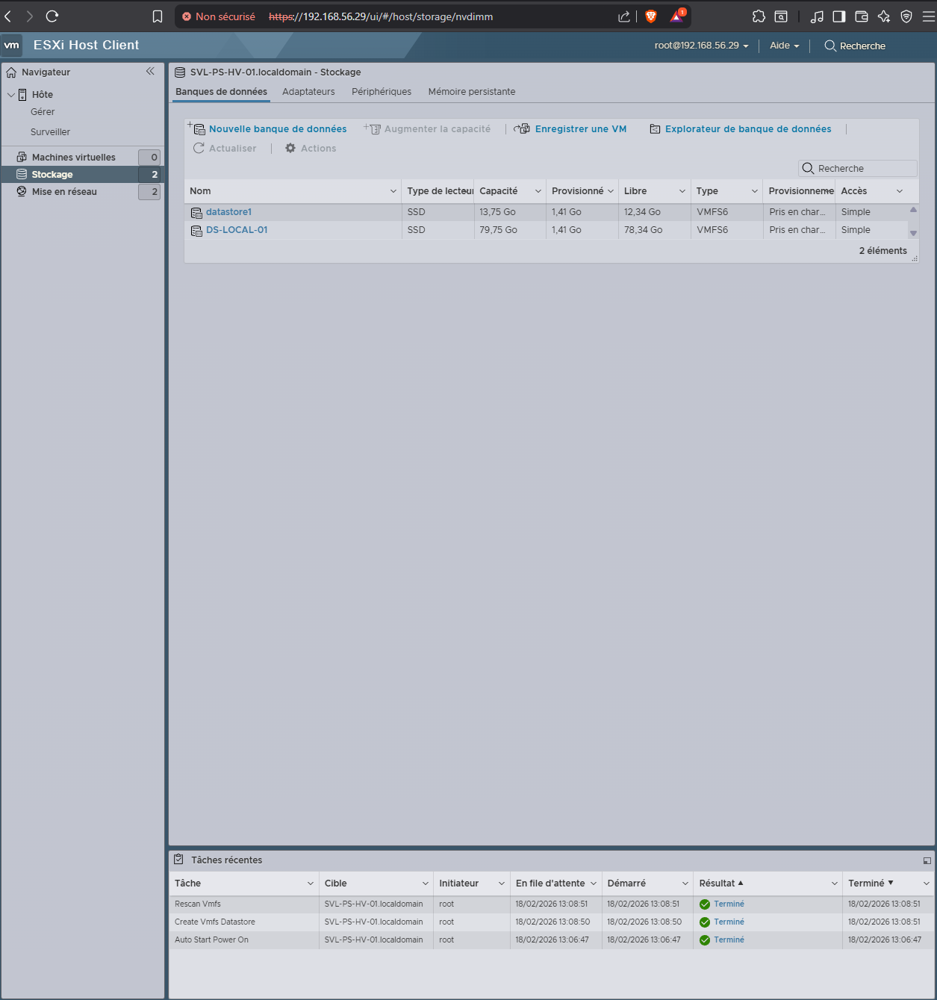

# ⚙️ Configuration initiale et sécurisation d’ESXi

## 🎯 Objectif

Cette phase vise à :

- sécuriser l’accès à l’hyperviseur
- stabiliser l’environnement de virtualisation
- préparer l’hébergement des machines virtuelles critiques

Elle constitue la base nécessaire avant tout déploiement
de services ou de machines virtuelles dans l’infrastructure.

---

## 🔐 Sécurisation des accès

Plusieurs mesures sont appliquées afin de réduire la surface d’exposition
de l’hyperviseur :

- définition d’un **mot de passe administrateur robuste**
- limitation de l’accès à l’interface d’administration au **réseau local**
- désactivation des services distants non nécessaires hors maintenance
- sauvegarde de la **configuration ESXi** après paramétrage

Ces bonnes pratiques s’inscrivent dans une logique
de sécurisation minimale d’un hyperviseur en environnement réel.

---

## ⏱ Synchronisation temporelle

Une source de temps fiable est configurée afin de garantir :

- la cohérence des journaux système
- la validité des certificats
- le bon fonctionnement des sauvegardes et restaurations

La synchronisation horaire constitue un prérequis essentiel
dans tout environnement virtualisé ou sauvegardé.

---

## 🗄️ Configuration du stockage

### Datastore local

Lors de l’installation d’ESXi, un datastore initial est détecté automatiquement.  
Afin d’adapter l’infrastructure aux besoins du laboratoire, un **disque SSD
supplémentaire de 80 Go** a été ajouté puis configuré comme datastore dédié.

Nom du datastore :

> **DS-LOCAL-01**

Ce datastore est destiné à :

- l’hébergement des machines virtuelles de la phase ESXi  
- le stockage des fichiers systèmes et disques virtuels  
- la séparation logique entre le système ESXi et les données virtualisées  

Cette organisation améliore :

- la lisibilité de l’infrastructure  
- la gestion du stockage  
- les performances d’accès disque pour les VM  

---

### 📸 Vérification du datastore

Le datastore **DS-LOCAL-01** est correctement détecté par l’hyperviseur,
avec une capacité totale correspondant au disque SSD ajouté.

Cette validation confirme :

- la disponibilité du stockage pour les VM  
- l’absence d’erreur matérielle  
- la bonne intégration du disque dans ESXi  

---

## 🧪 Validation globale

L’environnement est considéré comme prêt lorsque :

- l’accès à l’interface Web ESXi est stable  
- aucune alerte critique n’est présente dans les logs  
- les ressources **CPU, mémoire et stockage** sont opérationnelles  
- le datastore **DS-LOCAL-01** est disponible pour l’hébergement des VM  

Cette étape marque la transition vers la **mise en place du réseau virtuel**
et le déploiement de l’infrastructure de la phase ESXi.

---

## 🧠 Conclusion

La configuration initiale permet de disposer :

- d’un hyperviseur sécurisé  
- d’un stockage dédié aux machines virtuelles  
- d’un environnement stable prêt pour l’exploitation  

ESXi constitue désormais une **base fiable**
pour la construction de l’infrastructure virtualisée du laboratoire.
