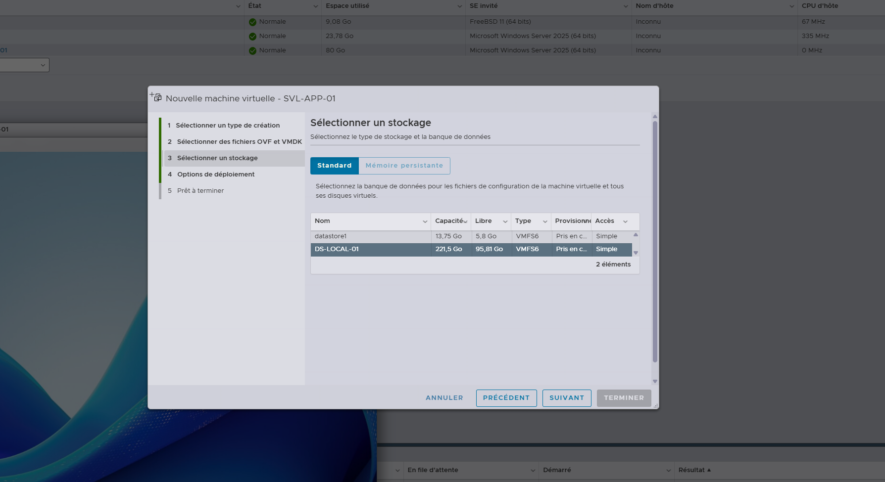
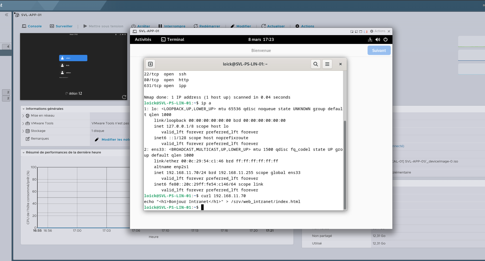
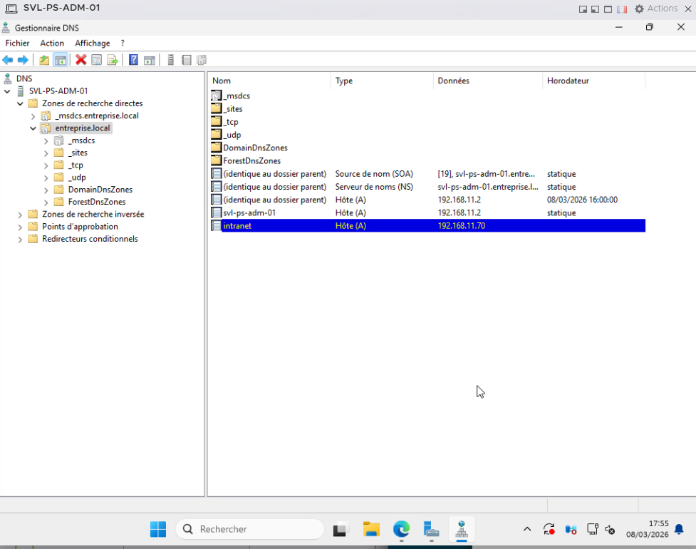
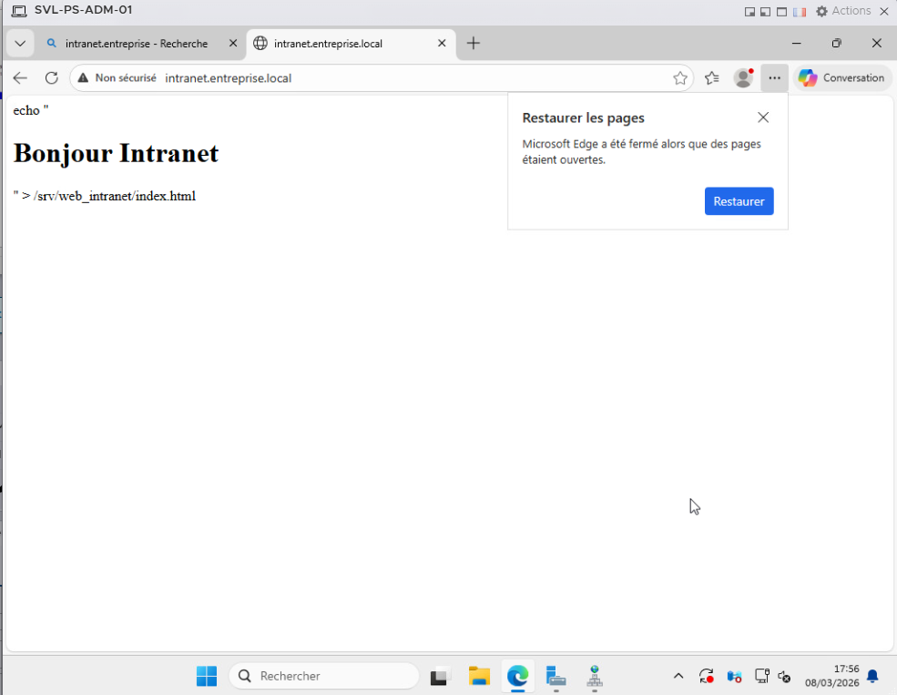

# 🖥️ SVL-PS-LIN-01 – Serveur Intranet

## 🎯 Objectif
Cette machine virtuelle héberge le **service intranet de l’entreprise** et permet l’accès interne aux ressources et informations partagées.

---

## 🖥️ Informations VM

| Paramètre | Valeur |
|-----------|--------|
| Hyperviseur | VMware ESXi 8.0 |
| Stockage | DS-LOCAL-01 |
| Nom de la VM | SVL-PS-LIN-01 |
| Accès | intranet.entreprise.local |
| IP | 192.168.11.70 |
| Masque | 255.255.255.0 |
| Passerelle | 192.168.11.1 |
| DNS | 192.168.11.2 |

---

## 🔧 Actions réalisées

### 1️⃣ Migration de la VM
Migration de la machine virtuelle depuis **VMware Workstation** vers **VMware ESXi**.

---

### 2️⃣ Import et démarrage
Import de la VM sur le datastore **DS-LOCAL-01** et démarrage sur l’hyperviseur ESXi.

---

### 3️⃣ Configuration DNS
Ajout d’un **enregistrement DNS A** pointant vers l’IP de la VM afin d’accéder à l’intranet via un nom de domaine interne.
intranet.entreprise.local → 192.168.11.70

---

### 4️⃣ Vérification d’accès
Test d’accès au service intranet via le navigateur en utilisant le nom DNS.

---

## 🧪 Validation globale

- ✅ Résolution DNS fonctionnelle  
- ✅ Accès à l’intranet via `intranet.entreprise.local`  
- ✅ Service accessible depuis le réseau interne  
- ✅ Machine virtuelle opérationnelle sur ESXi  
- ✅ Captures d’écran ajoutées pour la traçabilité
