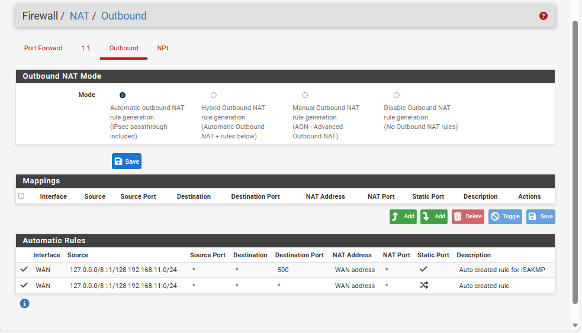

# Configuration NAT

Le NAT (Network Address Translation) permet aux machines du réseau interne d’accéder à Internet en utilisant l’adresse IP de l’interface WAN.

## Mode NAT utilisé

- NAT automatique (mode par défaut pfSense)
- Génération automatique des règles sortantes

## Fonctionnement

- Les machines internes utilisent des adresses IP privées
- pfSense traduit ces adresses vers l’IP WAN
- Aucun accès entrant depuis Internet n’est autorisé

## Justification du choix

- Simplicité de mise en œuvre
- Sécurité par défaut
- Adapté à un environnement de type PME et à un lab pédagogique
