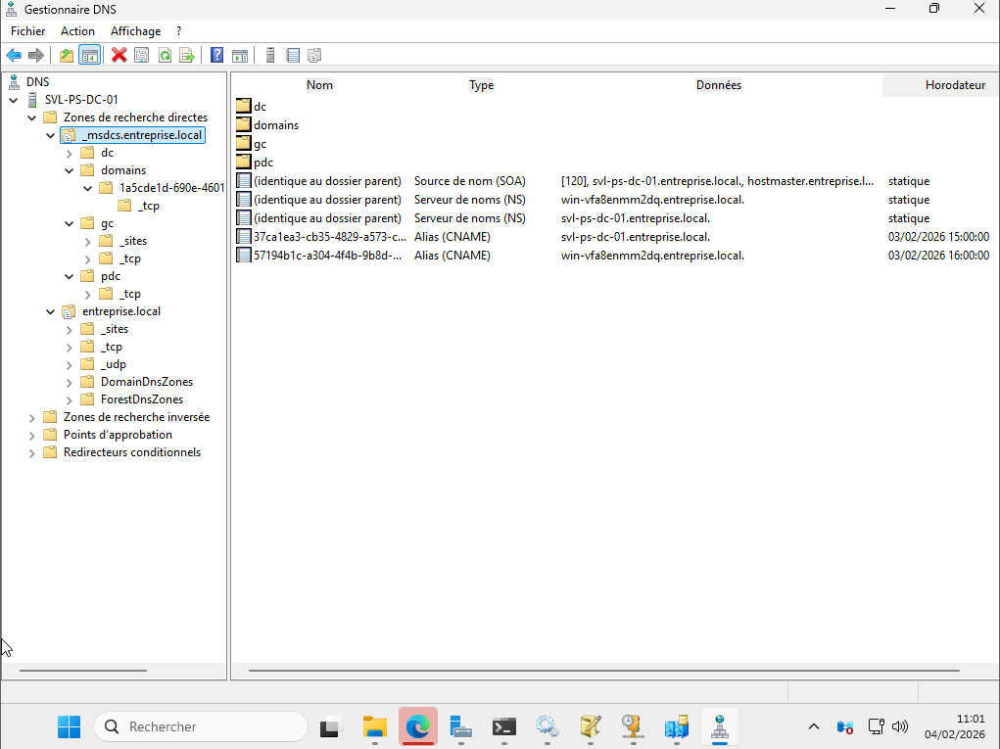

# DNS – DC1

## Présentation
Le service DNS est installé sur DC1 et intégré à Active Directory.
Les zones DNS sont répliquées automatiquement entre les contrôleurs de domaine.

## Zones DNS
Les zones du domaine sont configurées en mode intégré à Active Directory,
garantissant la redondance et la cohérence des enregistrements DNS.

## Enregistrements DNS des contrôleurs de domaine
Les enregistrements A des contrôleurs de domaine sont présents
et permettent la résolution correcte des services AD.

## Zone _msdcs
La zone `_msdcs` contient les enregistrements nécessaires
au bon fonctionnement d’Active Directory (LDAP, Kerberos, GC).

## Conclusion
Le DNS repose sur une architecture à double serveur,
avec réplication Active Directory assurant la haute disponibilité.
