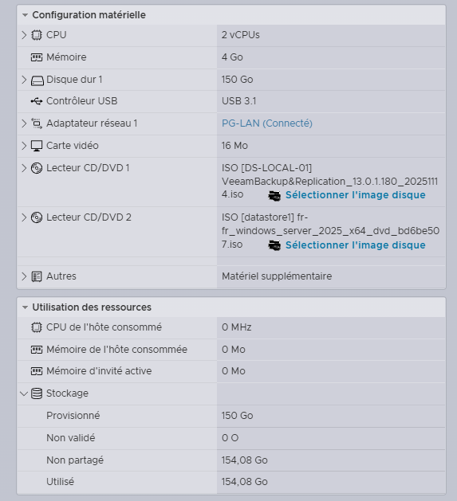

# 04 — Déploiement de la VM SVL-PS-VEEAM-01

## Configuration matérielle

| Composant | Valeur |
|-----------|--------|
| CPU | 2 vCPUs |
| Mémoire | 4 Go |
| Disque dur | 150 Go |
| Réseau | PG-LAN |
| Carte vidéo | 16 Mo |
| Contrôleur USB | USB 3.1 |

---

## ISO montées

| Lecteur | ISO |
|---------|-----|
| CD/DVD 1 | VeeamBackup&Replication_13.0.1.180_20251114.iso |
| CD/DVD 2 | fr-fr_windows_server_2025_x64_dvd_bd6be507.iso |

---

## Résultat

La VM **SVL-PS-VEEAM-01** est correctement configurée sur l'hyperviseur ESXi, avec Windows Server 2025 et les deux ISO montées. Elle est prête pour l'installation de Veeam.