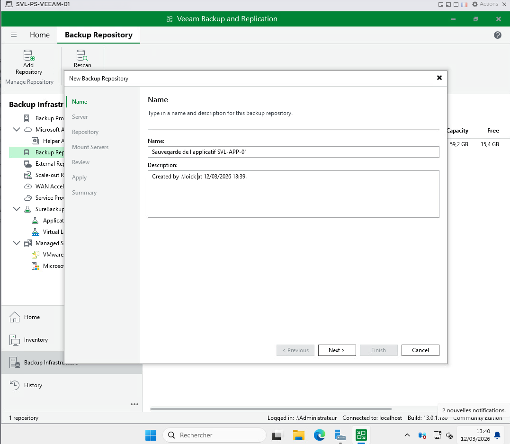
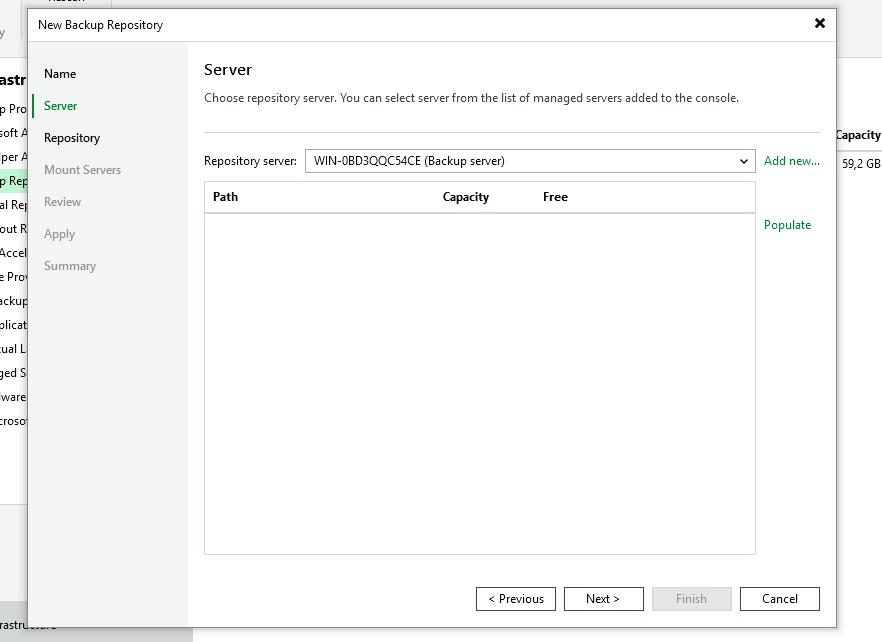
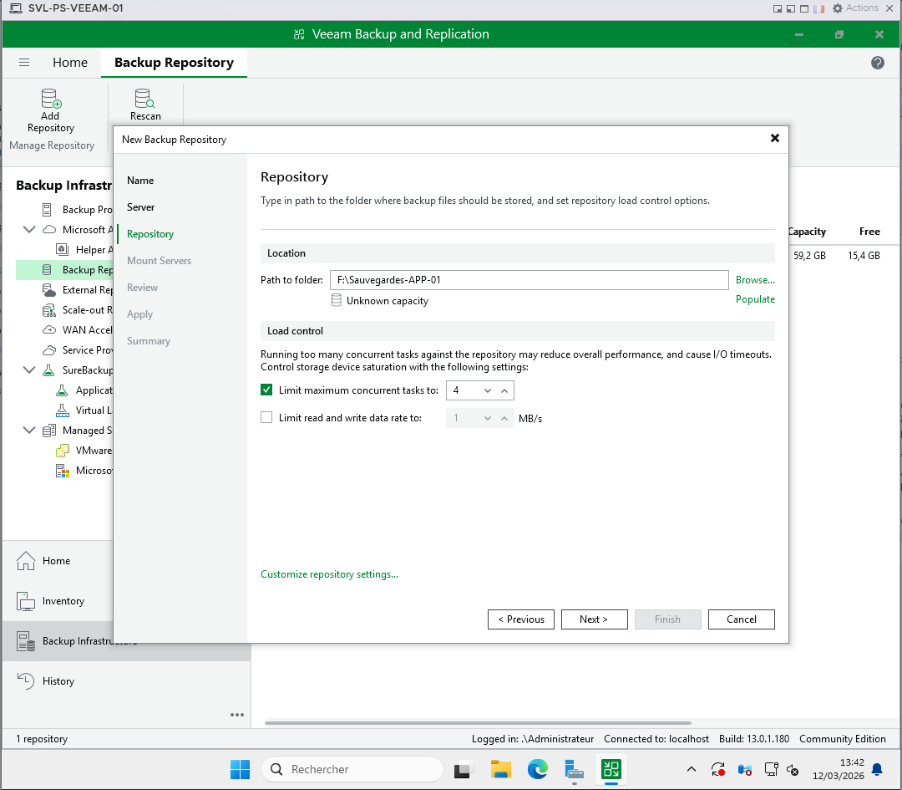
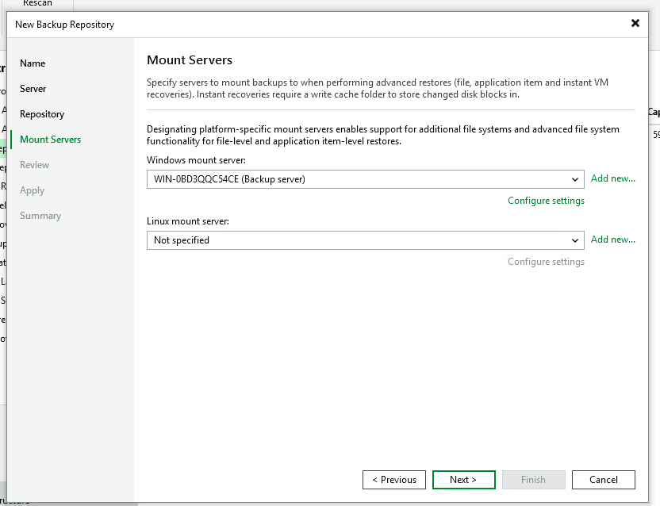
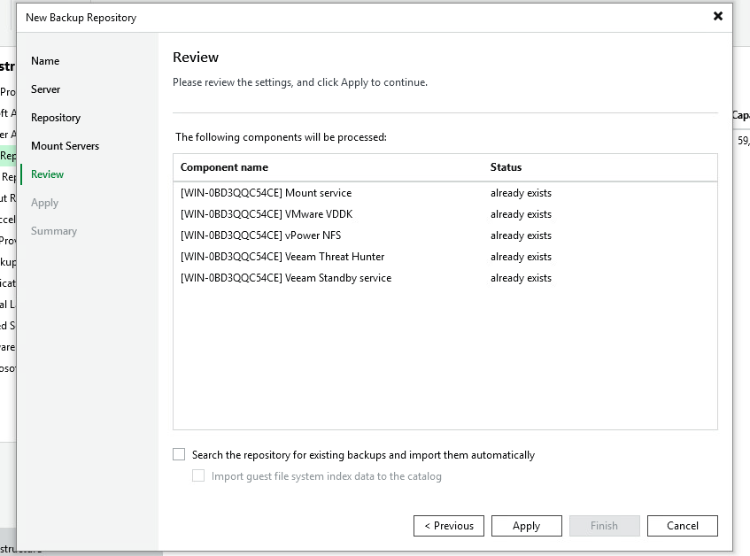
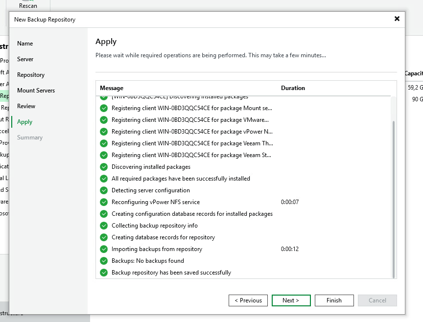
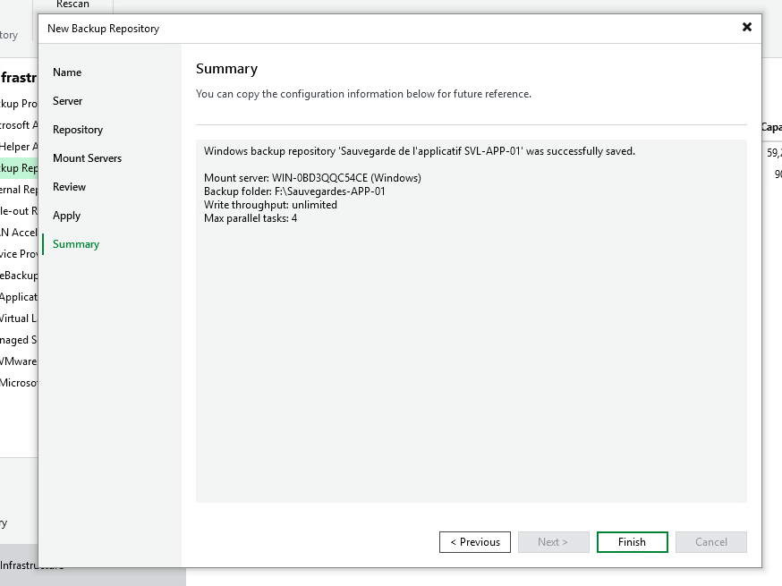

# 05 — Création du référentiel de sauvegarde

## Objectif

Créer un référentiel dédié dans Veeam pour stocker les sauvegardes de **SVL-APP-01**
sur le disque `F:\` (DS-LOCAL-01).

---

## Étapes

### 1. Nommer le référentiel

Nom : `Sauvegarde de l'applicatif SVL-APP-01`

---

### 2. Choisir le serveur

Sélection du serveur de backup : `WIN-0BD3QQC54CE (Backup server)`

---

### 3. Définir le chemin de stockage

Chemin : `F:\Sauvegardes-APP-01`  
Tâches simultanées max : `4`

---

### 4. Configurer le Mount Server

Mount server Windows : `WIN-0BD3QQC54CE (Backup server)`  
Utilisé pour les restaurations granulaires et la récupération instantanée.

---

### 5. Vérification des composants

Veeam vérifie que tous les composants nécessaires sont déjà présents :
- Mount service
- VMware VDDK
- vPower NFS
- Veeam Threat Hunter
- Veeam Standby service

---

### 6. Application des paramètres

Tous les composants sont enregistrés et le référentiel est sauvegardé avec succès.

---

### 7. Résumé

| Paramètre | Valeur |
|-----------|--------|
| Nom | Sauvegarde de l'applicatif SVL-APP-01 |
| Mount server | WIN-0BD3QQC54CE (Windows) |
| Dossier | F:\Sauvegardes-APP-01 |
| Débit en écriture | Illimité |
| Tâches parallèles max | 4 |

---

## Résultat

Le référentiel de sauvegarde est créé et prêt à recevoir les sauvegardes de **SVL-APP-01**.