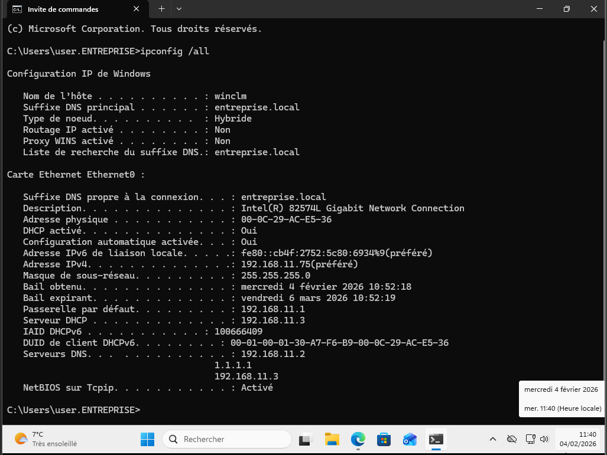

# Jonction du poste au domaine Active Directory

Le poste Windows 11 est joint au domaine **entreprise.local** afin de permettre :
- l’authentification centralisée des utilisateurs
- l’application des stratégies de groupe
- l’utilisation des services réseau du domaine

## Étapes réalisées
- Configuration du DNS du poste vers les contrôleurs de domaine
- Jonction au domaine via les paramètres système
- Redémarrage du poste

## Vérification
- Le poste apparaît dans l’Active Directory
- Le domaine est visible dans les paramètres système

## Capture

