# ⚙️ Installation de Centreon

## 1️⃣ Création de la machine virtuelle

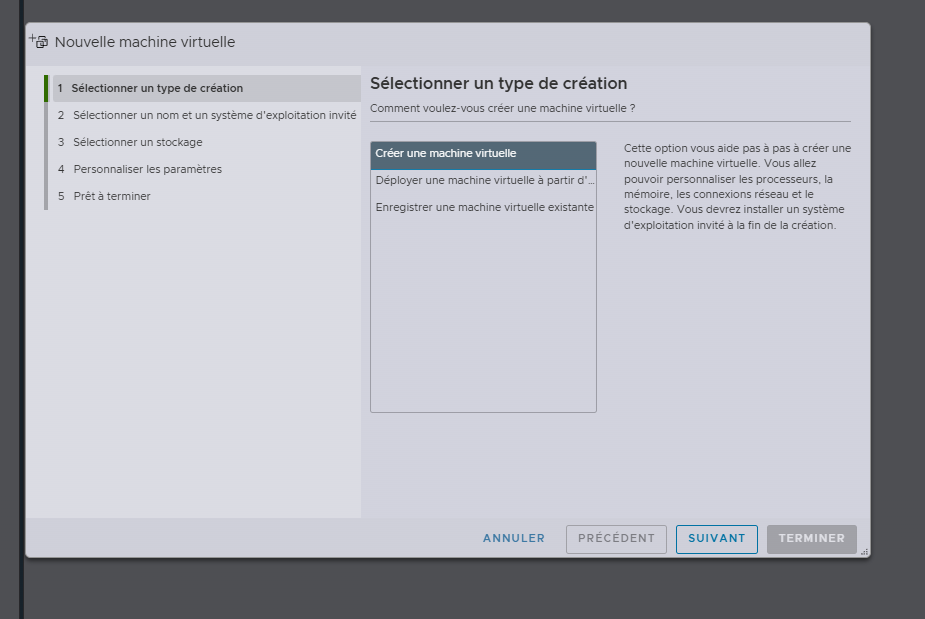

---

## 2️⃣ Configuration du stockage

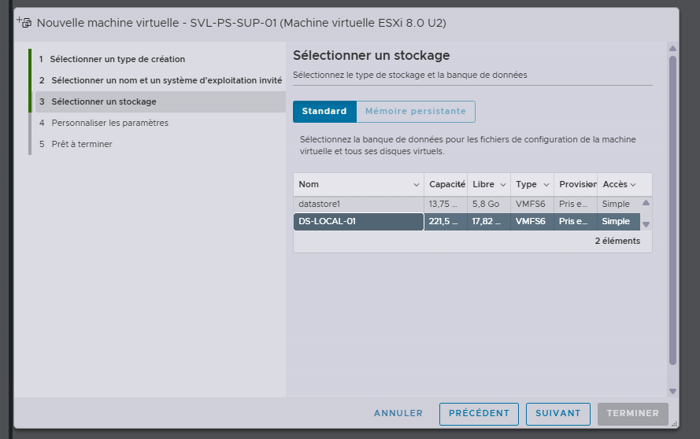

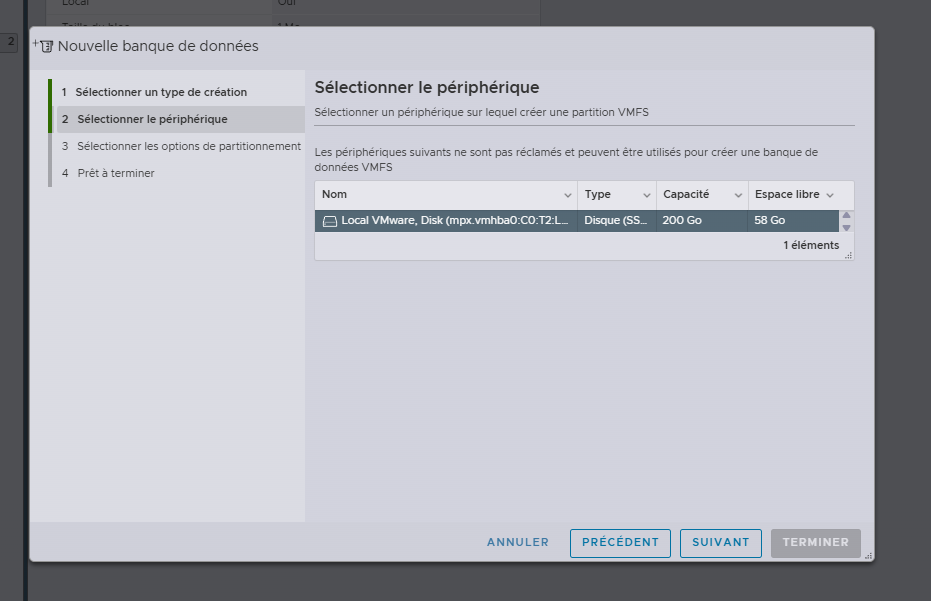

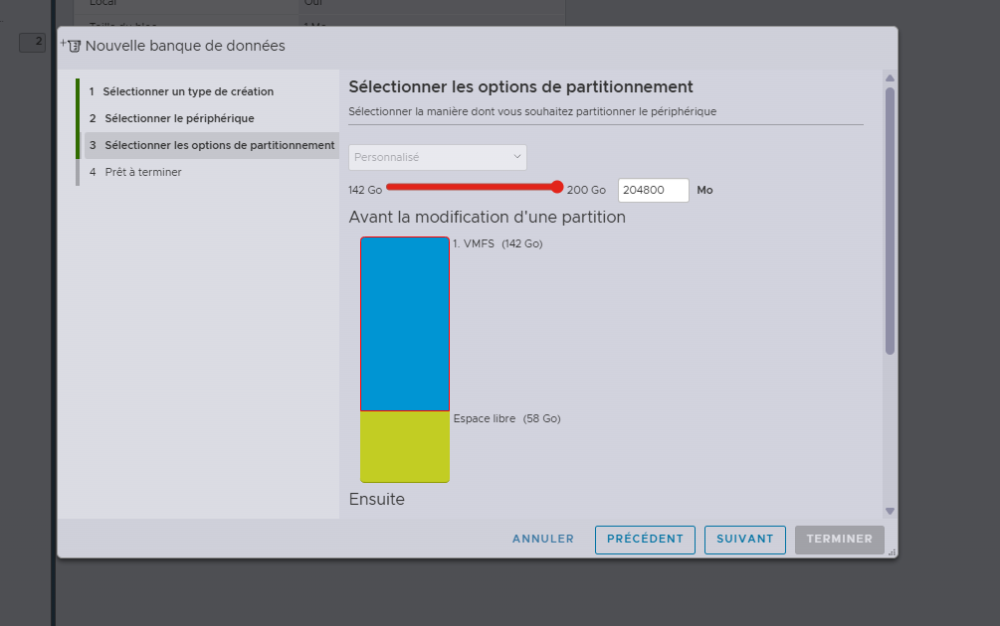

---

## 3️⃣ Migration ISO vers ESXi

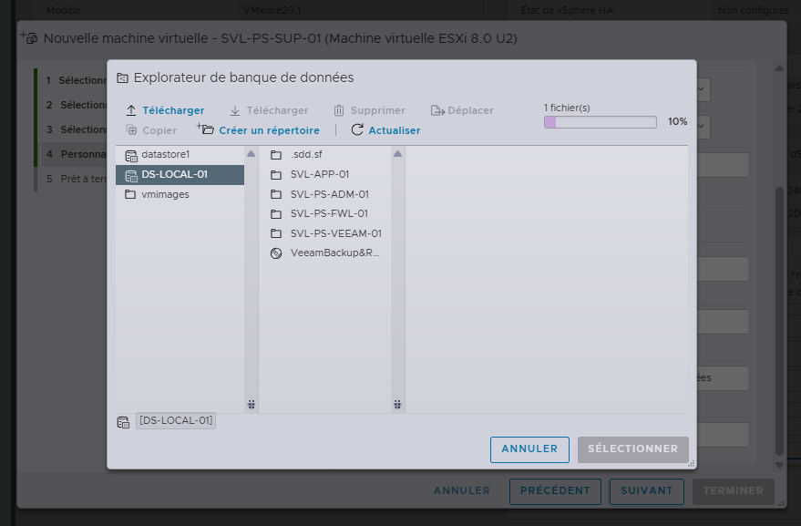

---

## 4️⃣ Installation Debian

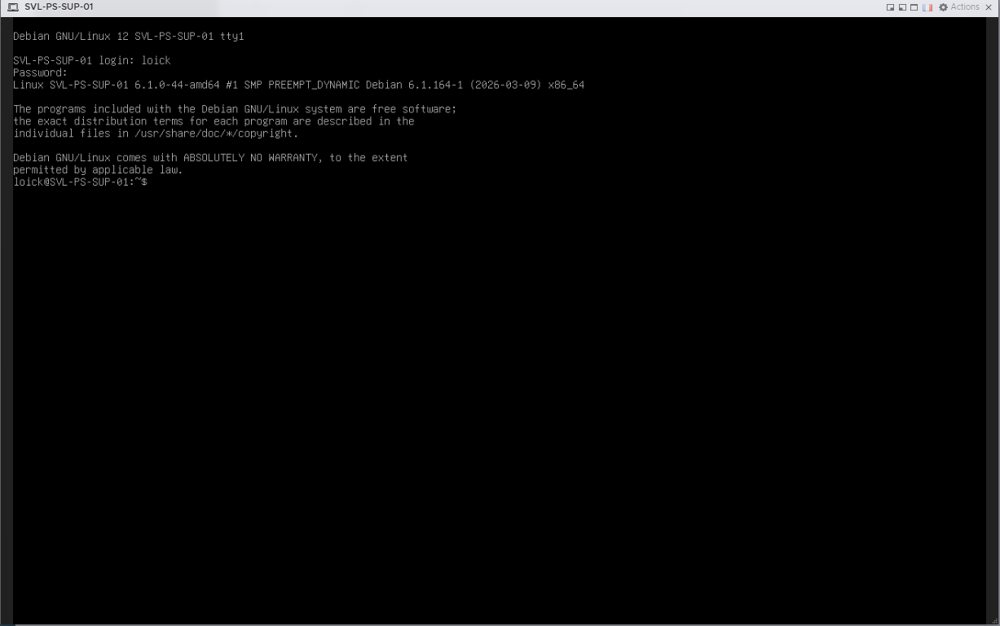

---

## 5️⃣ Installation des plugins Centreon

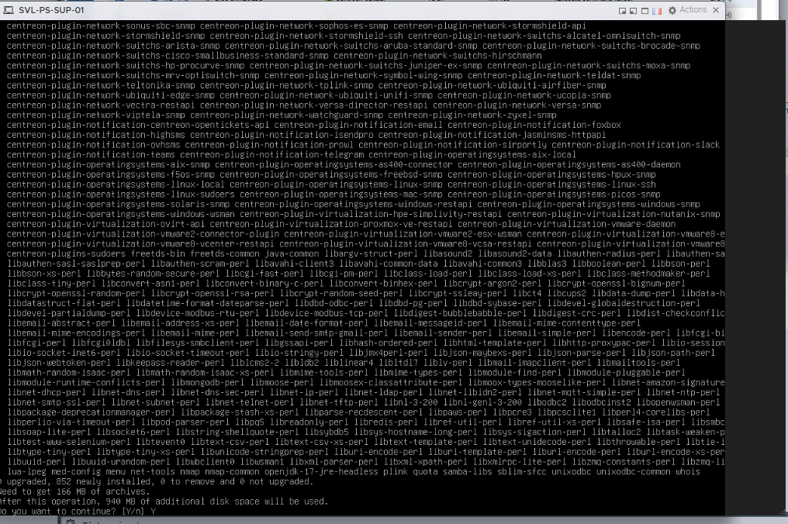

---

## 6️⃣ Centreon opérationnel

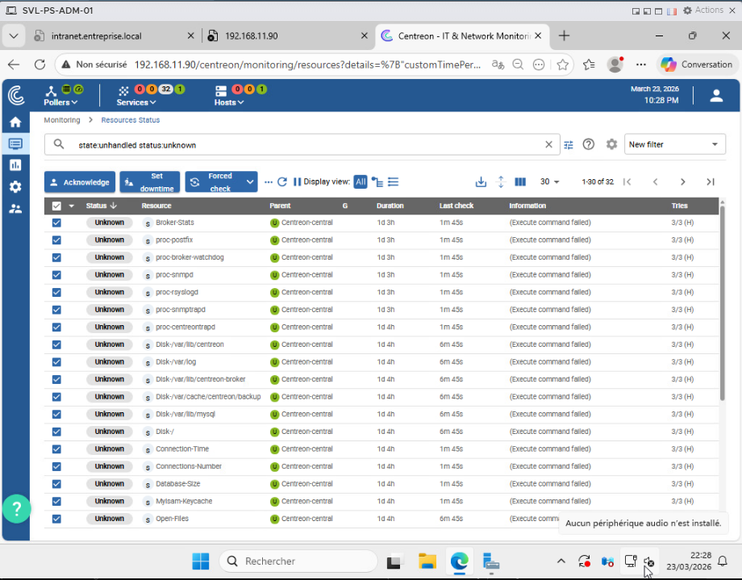

---

## 7️⃣ Configuration SNMP

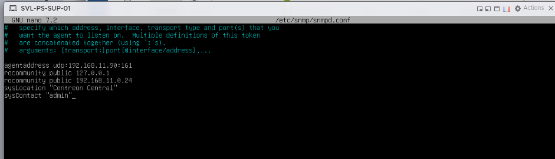

---

## 8️⃣ Gestion du swap

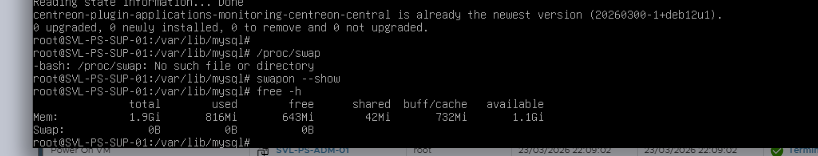

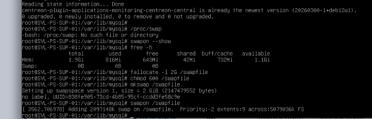

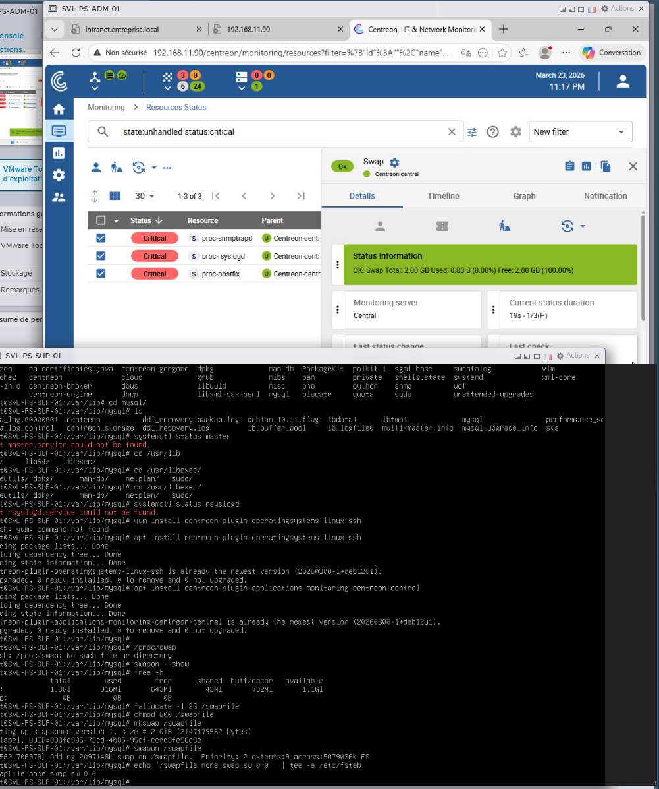

---

## ✅ Résultat

Centreon est installé, fonctionnel et prêt à superviser des équipements.
