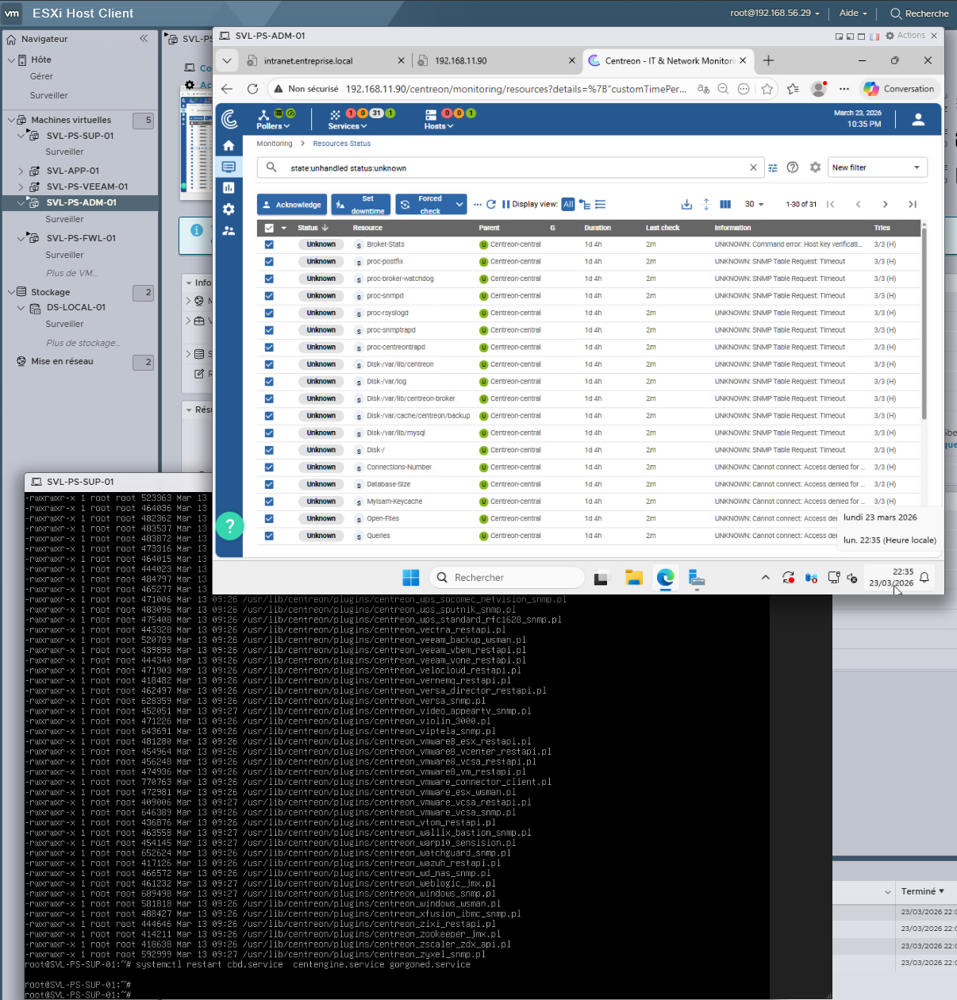
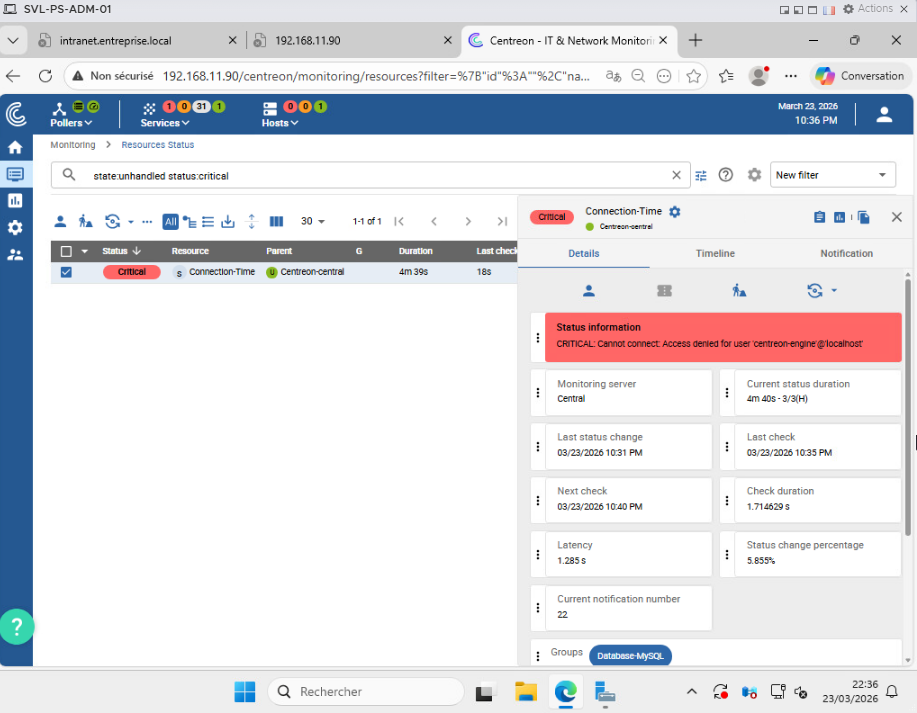
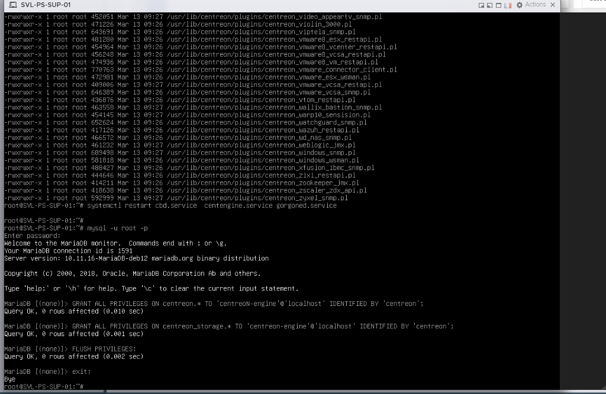
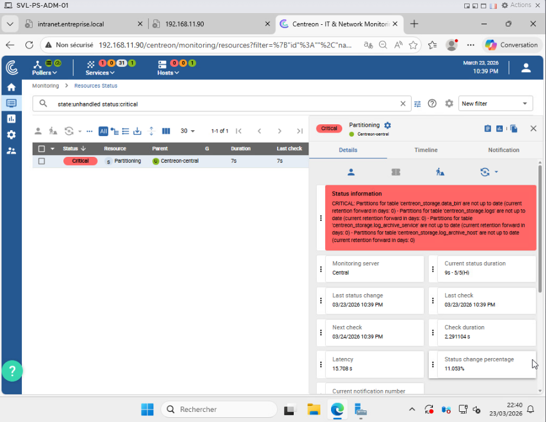
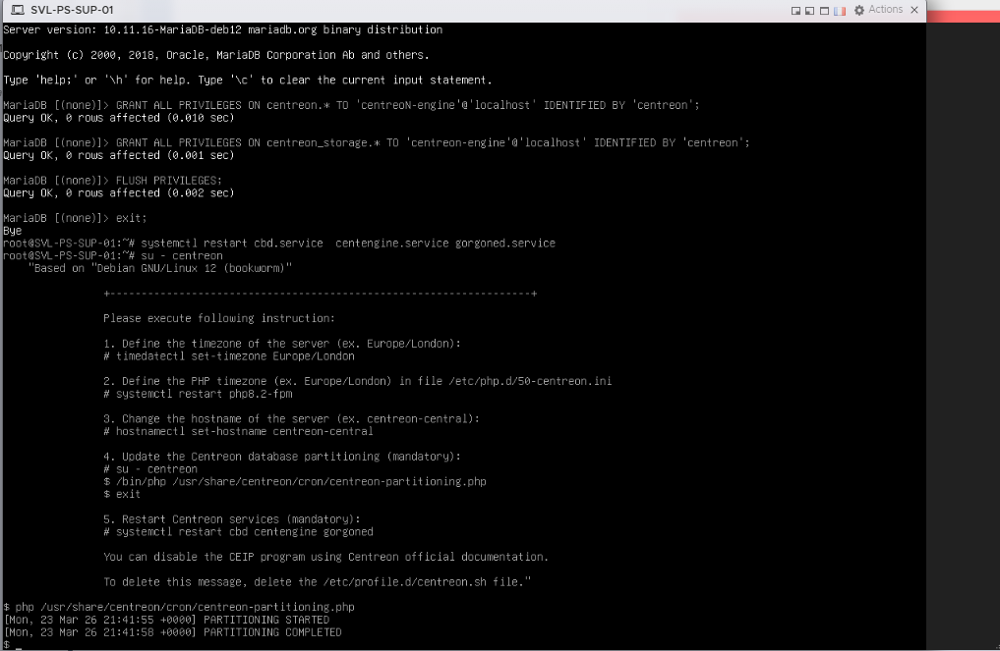
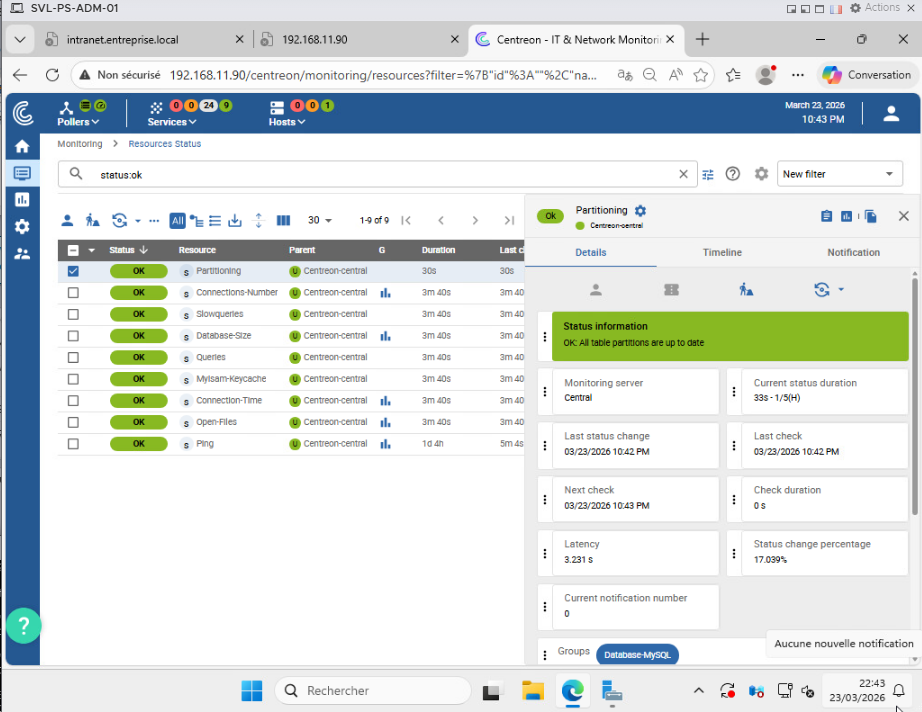
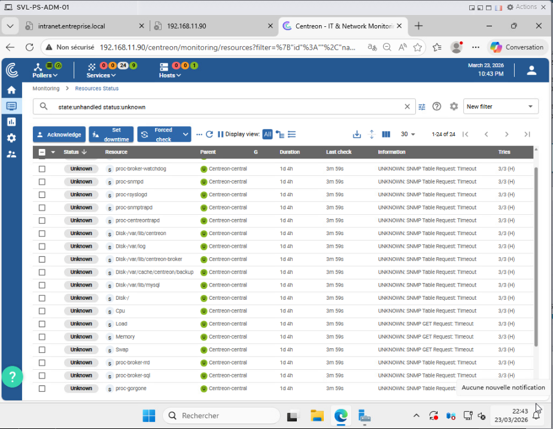
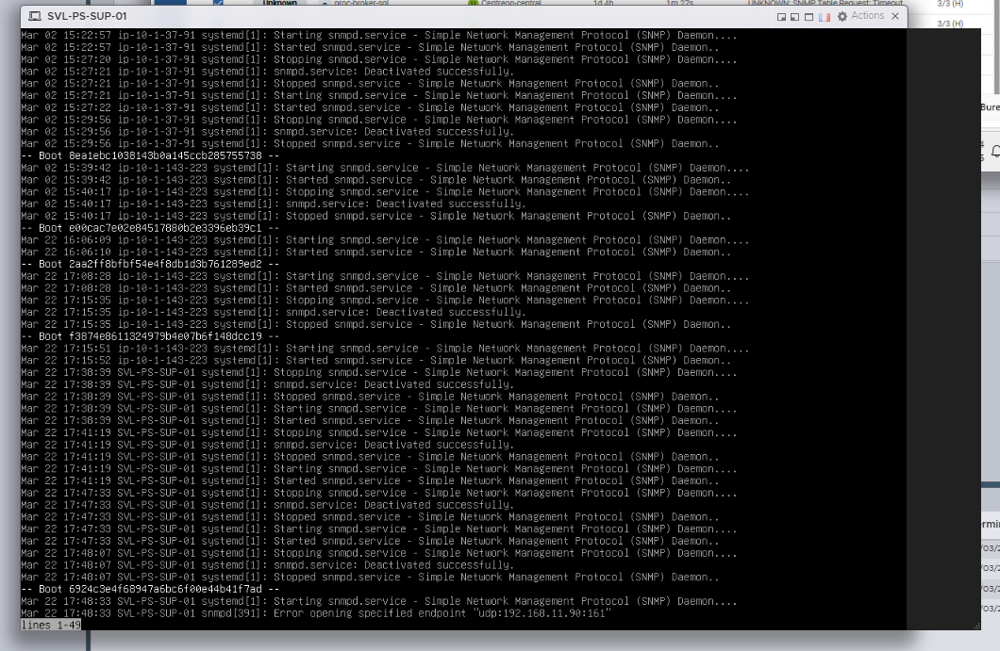
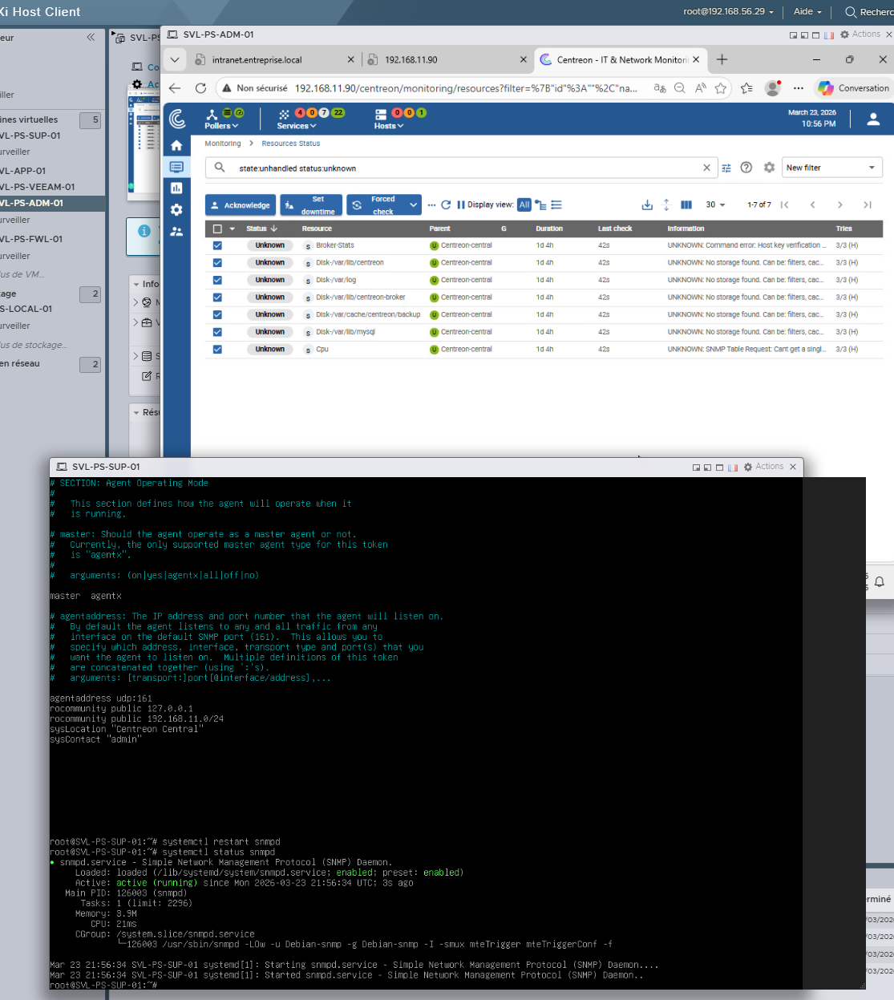

# 🛠️ Troubleshooting Centreon

## ❌ Exec Failed

👉 Cause possible :

* Plugin absent
* Mauvais chemin

---

## ❌ Problème utilisateur

👉 Solution :

* Vérifier les permissions utilisateur

---

## ❌ Droits base de données

👉 Solution :

* Vérifier les privilèges MySQL

---

## ❌ Problème de partition

👉 Solution :

* Vérifier espace disque
* Ajuster partitions

---

## ❌ Erreurs système supplémentaires

---

## ❌ Problème SNMP

---

## ✅ Résolution SNMP

---

## 🎯 Conclusion

Les erreurs rencontrées sont liées à :

* Permissions système
* Configuration SNMP
* Espace disque

Une approche méthodique permet de résoudre efficacement ces incidents.
