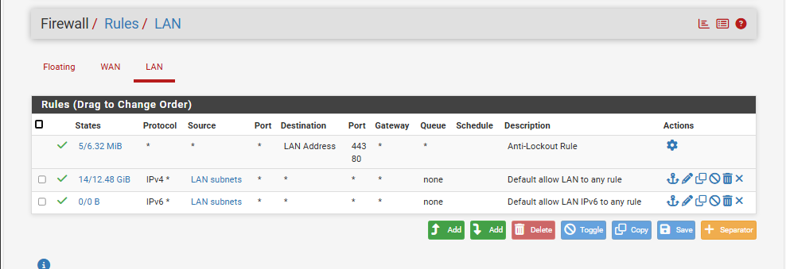

# Règles de pare-feu pfSense

La configuration des règles de pare-feu sur pfSense a été volontairement maintenue simple afin de garantir la lisibilité et la stabilité de l’environnement de test.

Les règles sont appliquées sur l’interface LAN, conformément au fonctionnement de pfSense (filtrage entrant par interface).

## Description des règles

- **Anti-Lockout Rule**  
  Règle automatique permettant l’accès à l’interface d’administration pfSense (ports 80 et 443).

- **Default allow LAN to any (IPv4)**  
  Autorise les machines du réseau LAN à communiquer librement avec les autres réseaux et Internet.  
  Cette règle permet le bon fonctionnement des services Active Directory, DNS et DHCP.

Cette approche minimaliste est volontaire et adaptée à un lab pédagogique, tout en restant conforme aux bonnes pratiques de base.
