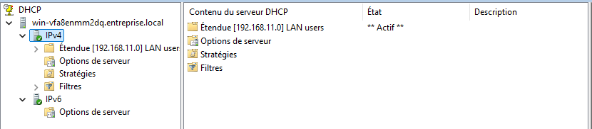

# DHCP Failover – DC2

Le serveur DC2 participe à la haute disponibilité du service DHCP
en tant que serveur partenaire de DC1.

---

## Étendue DHCP

L’étendue IPv4 est répliquée depuis DC1 et active sur DC2.

---

## Configuration du basculement

Le basculement DHCP est configuré en **équilibrage de charge** :

- Partenaire : DC1
- Mode : Load Balancing
- Synchronisation automatique des baux

---

## Options DHCP

Les options principales sont configurées au niveau de l’étendue :

- **003 – Routeur** : passerelle par défaut
- **006 – DNS Servers** : DC1 et DC2

---

## Fonctionnement

- Les deux serveurs distribuent des adresses IP
- En cas d’indisponibilité de DC1, DC2 continue le service
- Les baux sont synchronisés entre les serveurs
