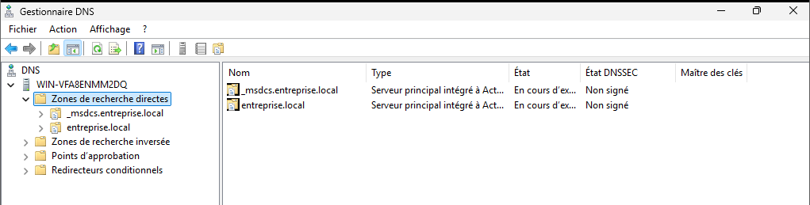

# DNS – DC2

Le serveur DC2 héberge le service DNS afin d’assurer la redondance de la résolution de noms
au sein du domaine `entreprise.local`.

---

## Zones DNS

Les zones suivantes sont présentes sur DC2 :

- `entreprise.local`
- `_msdcs.entreprise.local`

Ces zones sont **intégrées à Active Directory** et répliquées automatiquement entre DC1 et DC2.

---

## Enregistrements DNS

Les enregistrements des contrôleurs de domaine sont présents :

- DC1
- DC2

Cela permet la résolution correcte des services Active Directory et DNS.

---

## Fonctionnement

Le DNS fonctionne en **redondance active** :
- Les clients utilisent plusieurs serveurs DNS
- Aucun mécanisme de HA actif/passif

